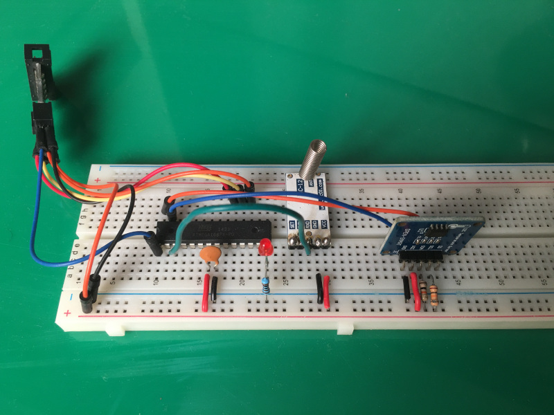
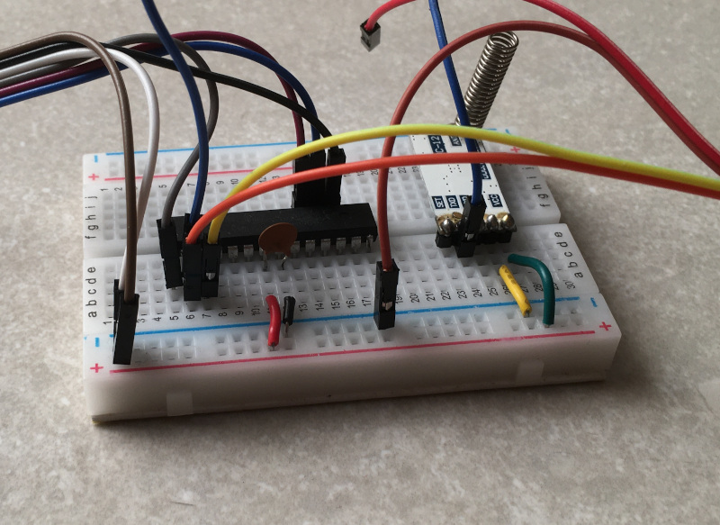

# hdlc_uart
Simple communication between two AVR microcontrollers using HDLC like frames and serial interface
## How does it work
The project consists of two modules:
* hc12_transmitter
* hc12_receiver

**hc12_transmitter** reads the high byte and low byte temperature from LM75a temperature sensor. It then encapsulates it in a frame
that has 0x7e as the opening and closing boundary byte. After first boundary frame, it sends a command byte, then it sends two bytes of data followed by an
8 bit CRC of the data. If there is 0x7e in the transmitted data, the transmitter should add an escapte byte of 0x7a but I 
haven't implemented that yet.

**hc12_receiver** setsup an interrupt for RX on uart. It then parses data and once a complete frame is received, it flags that frame
is ready. A while loop in the main body checks if the frame is ready; if yes, it validates the CRC. Upon the successful frame
receipt it switches based upon the command received.

